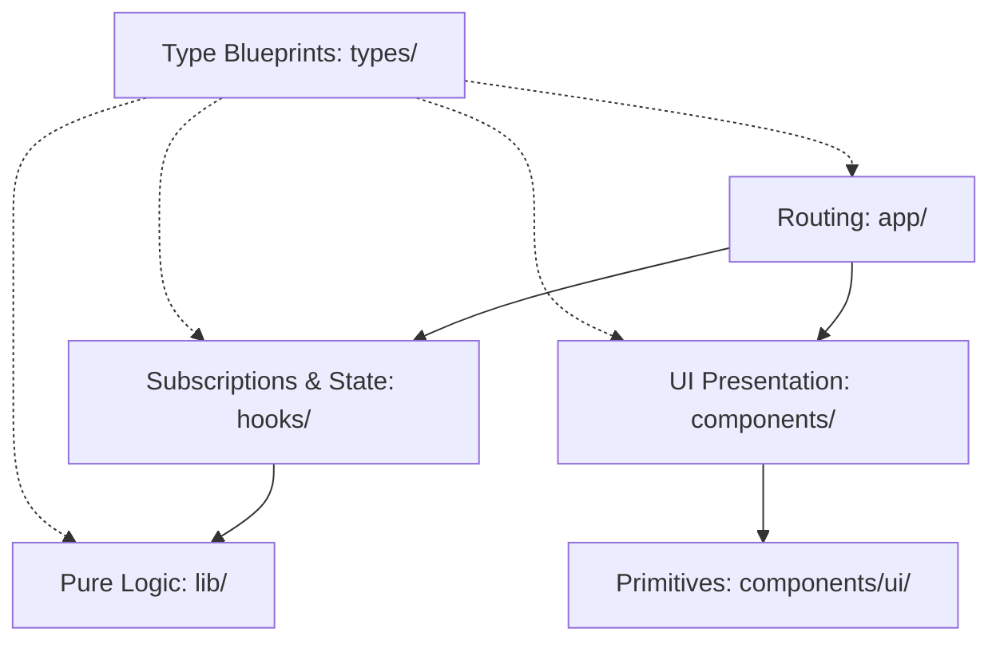

# Clean Architecture in Next.js (App Router): A Guide to Separation of Concerns

Welcome! This guide is designed to teach you clean architecture principles in modern Next.js (App Router), React, and TypeScript. Whether you are reading this on the train or reviewing it at your desk, this document will serve as a mental framework for decomposing monolithic code bases and eliminating "architectural slop."

---

## 1. The Core Problem: Architectural Bloat
When building applications quickly (especially when collaborating with AI assistants), it is common for files to grow into multi-hundred-line monoliths. A page component like a golf tournament leaderboard might end up doing:
1. **Routing & Auth:** Deciding if the user is authorized.
2. **Network I/O:** Connecting to Firestore or fetching live stats from an external ESPN API.
3. **Data Transformation:** Sorting players, filtering cuts, calculating payouts, and splitting prizes.
4. **UI Presentation:** Rendering responsive tables, buttons, timers, and dialog cards.

This mixing of concerns creates three distinct liabilities:
*   **Divergent Rule Implementations:** The same calculation rules are written in multiple places (e.g., in a component for rendering and in an API route for writing data), leading to code drift.
*   **Low Testability:** You cannot test a simple math formula without mocking DOM elements, network sockets, or browser states.
*   **Performance Bottlenecks:** Heavy computations (like sorting arrays) execute on *every single render*—including timer ticks or input keystrokes—causing UI lag.

---

## 2. Reorganized Directory Design

Below is the clean directory structure recommended for resolving these liabilities. In this structure, every file has a single responsibility.

```text
us-open-2026/
├── app/                             # Routing, Layouts, & API Routes (The Skeleton)
│   ├── admin/
│   │   └── page.tsx                 # Checks auth, renders AdminDashboard layout component
│   ├── api/
│   │   ├── finalize-standings/
│   │   │   └── route.ts             # POST endpoint: Executes server-side playoff logic
│   │   └── sync/
│   │       └── route.ts             # GET endpoint: Triggered by cron schedulers
│   ├── layout.tsx                   # Global fonts, metadata, and body wrapper
│   └── page.tsx                     # Main page: Calls hook, renders DashboardLayout
│
├── components/                      # Presentational Layer (The Skin)
│   ├── admin/                       # Scoped admin sub-components
│   │   ├── ControlPanel.tsx         # Card with sync/seed buttons
│   │   └── ParticipantTable.tsx     # Handles display of participants
│   ├── dashboard/                   # Scoped dashboard sub-components
│   │   ├── Countdown.tsx            # Visual timer
│   │   ├── LeaderboardTable.tsx     # Renders stats tables (receives data via props)
│   │   └── PlayerScoreboard.tsx     # Renders top 10 list
│   └── ui/                          # Reusable UI primitives (Buttons, Dialogs, Inputs)
│
├── hooks/                           # Side Effects & Subscriptions (The Nervous System)
│   ├── useAuth.ts                   # Google OAuth state machine
│   └── useTournamentData.ts         # Handles Firestore snapshot listeners
│
├── lib/                             # Core Domain & Pure Helpers (The Brain)
│   ├── constants.ts                 # Immutable configs (Prizes, schedules, endpoints)
│   ├── espn.ts                      # ESPN API scraper & database synchronizer
│   ├── firebase-admin.ts            # Server-side Firebase SDK configuration
│   ├── firebase.ts                  # Client-side Firebase SDK configuration
│   ├── scoring.ts                   # PURE functions: scoring, tie-breaking, payouts
│   └── utils.ts                     # Tailwind merging utility (cn)
│
└── types/                           # Strict Typings (The Blueprint)
    ├── index.ts                     # Shared interfaces (Participant, PlayerScore)
    └── espn.ts                      # Interfaces matching ESPN responses
```

---

## 3. The Five Pillars of Clean Architecture



### Pillar 1: Light Routes (`/app`)
*   **The Concept:** App Router pages (`page.tsx`) should act as simple entry points. They check authorization, initialize state-fetching hooks, and mount layout components.
*   **Best Practice:** Do not define HTML tables, inline dialogs, or Firestore database writes inside a page component. A page's code length should rarely exceed 50 lines.

### Pillar 2: Scoped Components (`/components`)
*   **The Concept:** Divide UI views into domain-specific subfolders.
*   **Best Practice:** Separate global visual primitives (`/components/ui/` like buttons, inputs) from complex, data-bound features (`/components/dashboard/`). Components should be **presentational**: they receive data via props, handle click callbacks, and contain styling. They do not initiate raw database queries.

### Pillar 3: Abstrate State via Custom Hooks (`/hooks`)
*   **The Concept:** Extract all browser side-effects, real-time database listeners (`onSnapshot`), and state mutations (`useState`, `useEffect`) into custom hooks.
*   **Best Practice:** Keep components clean by offloading side-effects to hooks. Instead of writing 50 lines of Firestore listener logic inside a dashboard page, instantiate a hook:
    ```typescript
    const { participants, scores, loading } = useTournamentData();
    ```

### Pillar 4: Pure Business Logic (`/lib`)
*   **The Concept:** Move calculations into pure utility functions inside `/lib`. A "pure" function is one that always returns the same output for a given input, and has no side effects (no DOM manipulation, no network calls, no console writes).
*   **Best Practice:** Code containing formulas—such as calculating golf scores, splitting prize money, or resolving scorecard playoffs—belongs in `lib/scoring.ts`. This allows you to run calculations on the server, the client, or inside serverless API routes without code duplication.

### Pillar 5: Centralized Types (`/types`)
*   **The Concept:** Standardize data contracts in centralized type files.
*   **Best Practice:** Centralize interfaces like `PlayerScore` or `Participant` in `types/index.ts`. If database collections, UI components, and API routes all import these definitions, type mismatches are caught by the compiler during development, not in production.

---

## 4. Teachable Lectures (The "Train" Sessions)

### Lecture 1: The DRY Principle & Code Divergence
When logic is duplicated (e.g. checking if a player is cut inside both the client view and the finalization API), you violate **DRY (Don't Repeat Yourself)**. 
If tournament rules change and you adjust the logic in the client view but forget the API, the client displays one score while the database writes another. Centralizing logic in a pure utility (`lib/scoring.ts`) resolves this:

```typescript
// lib/scoring.ts
export function isPlayerCut(player: PlayerScore, cutline: number | null): boolean {
  if (!player) return true;
  if (cutline !== null && typeof player.day1 === 'number' && typeof player.day2 === 'number') {
    return (player.day1 + player.day2) > cutline;
  }
  return !!player.isCut;
}
```
*Now, the database sync cron, the tiebreaker logic, and the UI table all import the exact same function.*

---

### Lecture 2: Testability (Pure vs. Impure Functions)
Consider this **impure** code component:
```tsx
// IMPURE: Hard to test!
export default function Leaderboard() {
  const [scores, setScores] = useState([]);
  useEffect(() => { fetch('/api/scores').then(r => r.json()).then(setScores) }, []);
  
  const formatted = scores.map(s => s.value > 0 ? `+${s.value}` : s.value);
  return <div>{formatted.join(', ')}</div>;
}
```
To test the formatting logic, you must mock the `/api/scores` network call, render the component, and inspect the HTML output.

By refactoring, we create a **pure** formatting function:
```typescript
// PURE: Extremely easy to test!
export function formatScore(score: number): string {
  if (score === 0) return 'E';
  return score > 0 ? `+${score}` : score.toString();
}
```
Testing this is simple:
```typescript
assert.equal(formatScore(5), "+5");
assert.equal(formatScore(-2), "-2");
```

---

### Lecture 3: React Lifecycles & Memoization
In React, a component re-renders when its state changes or its parent re-renders. 
In your original dashboard, a countdown timer ticks every second. This causes the main dashboard to re-render, re-sorting all 150+ players, re-calculating payouts, and re-splitting prizes *every single second*.

We fix this using `useMemo` inside our custom hook:
```typescript
// hooks/useTournamentData.ts
export function useTournamentData() {
  const [participants, setParticipants] = useState<Participant[]>([]);
  const [scores, setScores] = useState<Record<string, PlayerScore>>({});

  // Sorting and statistics calculations only run if participants or scores change!
  const sortedStats = useMemo(() => {
    return participants.map(p => getParticipantStats(p, scores))
                        .sort((a, b) => a.total - b.total);
  }, [participants, scores]);

  return { sortedStats };
}
```
*Now, when the countdown timer updates, the standings calculations are skipped entirely, saving valuable CPU cycles.*

---

### Lecture 4: Next.js Client-Server Boundaries
Next.js allows you to mix Client Components (with `'use client'`) and Server Components.
*   **Client Components** can use hooks (`useState`, `useEffect`) and listen to user interactions (clicks, keypresses), but they carry a larger JavaScript bundle weight.
*   **Server Components** render on the server, have direct secure access to databases, and send zero JavaScript to the browser.

By moving database queries and administrative actions (like database seeds and data clears) out of `app/admin/page.tsx` and into API routes or Next.js Server Actions:
1.  **Security improves:** Database credentials and whitelists stay on the secure server.
2.  **Size decreases:** The admin dashboard bundle size shrinks, making it load faster.
3.  **Clean interface:** The client component simply calls `fetch('/api/seed', { method: 'POST' })` and awaits the response.
